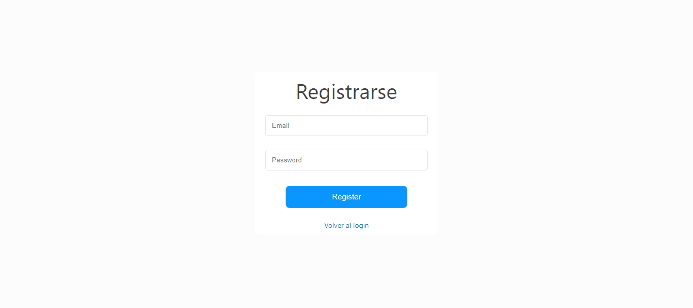
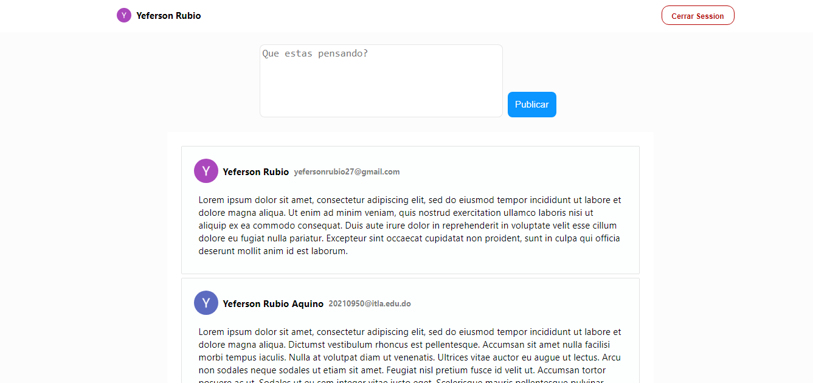
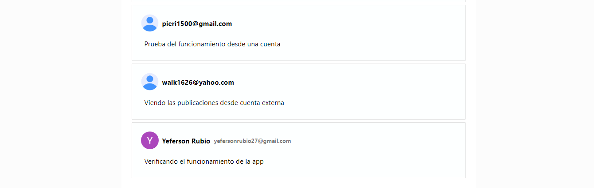

## Paquetes necesarios 

##### `npm start`
##### `npm firebase`
##### `npm install react-router-dom`
### Para ejecutar el programa `npm start`
# Funcionamiento
### Registrarse
 `http://localhost:3000/register`

### Loguearse
 `http://localhost:3000/login`

En caso de olvidar la contraseña puede recuperarla
`http://localhost:3000/recoverpassword`

Puede publicar nuevos post y ver los publicados por otros usuarios
`http://localhost:3000/`

